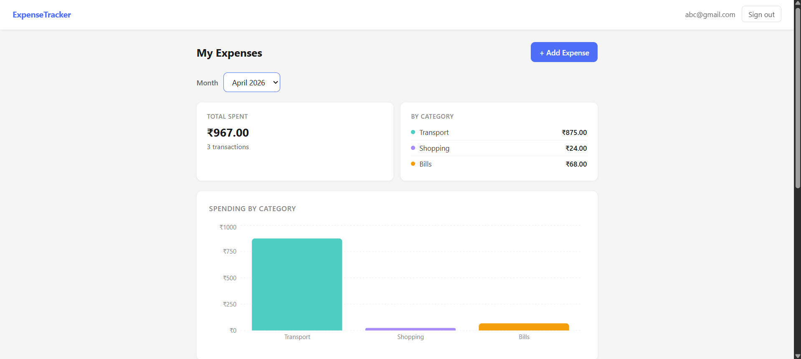
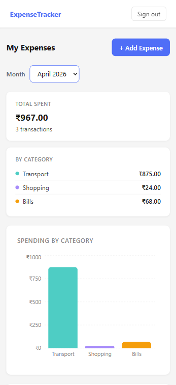

# Expense Tracker

A full-stack personal finance app for tracking monthly expenses — built as my first React project and first project with a real backend, authentication, and database.

🔗 **Live Demo:** [Expense Tracker App](https://expense-tracker-beta-ruby-92.vercel.app)
---

## Features

- Email/password authentication (sign up, log in, log out)
- Add, edit inline, and delete expenses
- Categories: Food, Transport, Shopping, Bills, Health, Other
- Monthly filter — view and analyze any past month
- Summary cards — total spent and per-category breakdown
- Bar chart — spending by category (Recharts)
- Line chart — daily spending trend for the selected month
- Row Level Security — users can only access their own data
- Loading, empty, and error states throughout
- Fully mobile responsive

---

## Tech stack

| Layer | Technology |
|---|---|
| Frontend | React 18 (Vite), CSS Modules |
| Backend / Database | Supabase (PostgreSQL + Auth) |
| Charts | Recharts |
| Deployment | Vercel (frontend), Supabase (backend) |
| Version control | Git / GitHub |

---

## Local setup

### Prerequisites
- Node.js 18+
- A free [Supabase](https://supabase.com) account
- A free [Vercel](https://vercel.com) account

### 1. Clone the repo

```bash
git clone https://github.com/Shreyash-Bhimte/expense-tracker.git
cd expense-tracker
npm install
```

### 2. Create a Supabase project

1. Go to [supabase.com/dashboard](https://supabase.com/dashboard) and create a new project
2. In the SQL Editor, run the following to create the expenses table and enable Row Level Security:

```sql
create table expenses (
  id uuid default gen_random_uuid() primary key,
  user_id uuid references auth.users(id) on delete cascade not null,
  amount numeric(10, 2) not null,
  category text not null,
  date date not null,
  note text,
  created_at timestamptz default now() not null
);

alter table expenses enable row level security;

create policy "Users can read own expenses"
  on expenses for select using (auth.uid() = user_id);

create policy "Users can insert own expenses"
  on expenses for insert with check (auth.uid() = user_id);

create policy "Users can update own expenses"
  on expenses for update using (auth.uid() = user_id);

create policy "Users can delete own expenses"
  on expenses for delete using (auth.uid() = user_id);
```

3. In Supabase → Authentication → Providers → Email, disable **Confirm email** for local development

### 3. Set environment variables

Create a `.env.local` file in the project root:
```
VITE_SUPABASE_URL=your_project_url
VITE_SUPABASE_ANON_KEY=your_anon_key
```

Both values are in Supabase → Project Settings → API.

### 4. Run locally

```bash
npm run dev
```

Open [http://localhost:5173](http://localhost:5173).

---

## Project structure

```
src/
├── components/       # Reusable UI — ExpenseItem, ExpenseList, charts, Spinner
├── pages/            # Login, Signup, Dashboard, AddExpense
├── hooks/            # useAuth, useExpenses — Supabase logic extracted from components
├── lib/              # supabaseClient.js, categories.js, expenseUtils.js
└── App.jsx           # Route definitions
```

---

## Key concepts learned

- **JSX** — syntactic sugar over React.createElement, compiled by Vite
- **useState / useEffect** — local state and side effects with dependency arrays
- **Lifting state up** — child components trigger parent state changes via prop callbacks
- **Custom hooks** — useAuth and useExpenses extract all Supabase logic out of components
- **Derived state** — filtered expenses and summary totals computed directly, never stored
- **Protected routes** — ProtectedRoute and PublicRoute guard all authenticated pages
- **Row Level Security** — PostgreSQL-level policy ensuring users only access their own rows
- **Environment variables** — Vite's import.meta.env with .env.local, never committed
- **Error boundaries** — class component catching render errors app-wide

---

## Deployment

Frontend is deployed on Vercel with automatic deployments on every push to `main`.

Environment variables are configured in Vercel → Project Settings → Environment Variables.

---

## Screenshots



---

## Author

Shreyash Bhimte — [github.com/Shreyash-Bhimte](https://github.com/Shreyash-Bhimte)